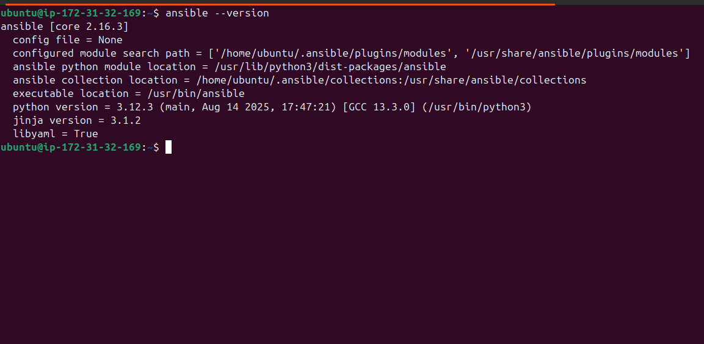
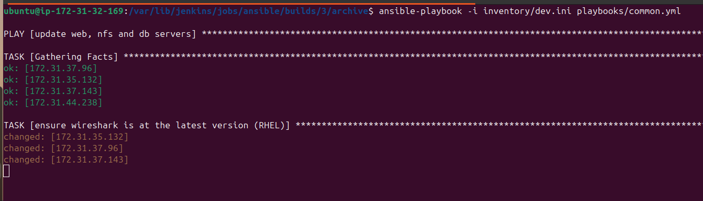
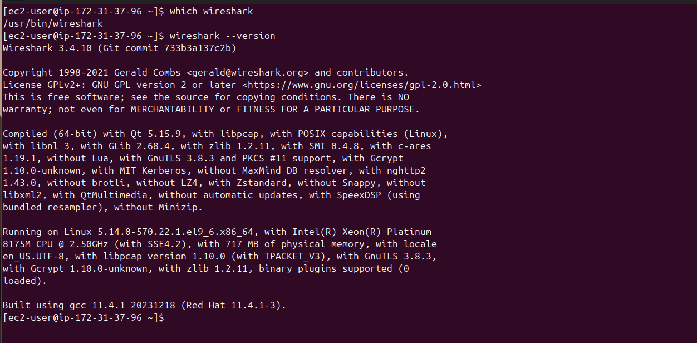
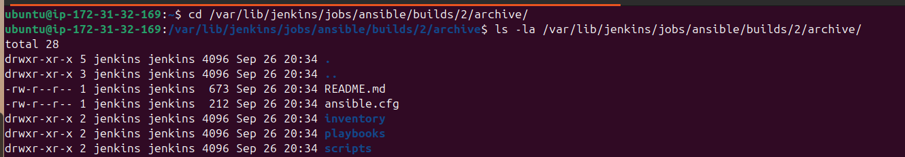

# Ansible Configuration Management (Automate Project 7→10)

*Comprehensive step-by-step guide for the `ansible-config-mgt` repo (Jenkins-Ansible controller + playbooks + inventory).*

---

## Quick checklist (run-through)

1. Launch an EC2 instance → set **Name** tag to `Jenkins-Ansible`. (Install Jenkins there.)
2. Allocate Elastic IP (optional, recommended) and associate with the instance.
3. Install Ansible on the Jenkins-Ansible instance.
4. Create GitHub repo `ansible-config-mgt` and push repo there.
5. Create a Jenkins **Freestyle** job `ansible` pointing to the repo, enable GitHub webhook trigger and **Archive the artifacts** with pattern `**/*`.
6. Create branch `feature/...`, add `playbooks/`, `inventory/`, push, open PR → merge to `main`.
7. Verify Jenkins automatically builds and archives artifacts to:

   ```
   /var/lib/jenkins/jobs/ansible/builds/<build_number>/archive/
   ```
8. Run playbooks from Jenkins (or locally) with:

   ```
   ansible-playbook -i inventory/dev.ini playbooks/common.yml
   ```

---

# 1. Overview & goal

This repo and guide show how to set up an Ansible controller on a Jenkins EC2 instance (named `Jenkins-Ansible`) and use Jenkins + GitHub webhooks to archive repository contents on every change to the `main` branch. It also demonstrates a sample common playbook and inventory layout for dev/staging/uat/prod.

---

# 2. Prerequisites

* An AWS EC2 instance (Ubuntu or RHEL) where you install Jenkins and Ansible; change instance **Name** tag to `Jenkins-Ansible`.
* GitHub account.
* Basic SSH key pair that can reach target servers (target servers must allow the key).
* Local dev machine with Git and optionally VSCode (Remote - SSH).
* Jenkins GitHub plugin and (optionally) SSH Agent plugin installed on Jenkins.

---

# 3. Install Ansible on Jenkins-Ansible (example: Ubuntu)

SSH into your Jenkins-Ansible instance and run:

```bash
# update
sudo apt update && sudo apt upgrade -y

# install python + pip + ansible (two options shown)

# Option A: apt
sudo apt install -y ansible

# Option B: pip (virtualenv recommended)
sudo apt install -y python3 python3-venv python3-pip
python3 -m venv ~/ansible-venv
source ~/ansible-venv/bin/activate
pip install --upgrade pip
pip install ansible
# leave venv activated when running ansible from an interactive shell
```

Check version:

```bash
ansible --version
```
 
---

# 4. GitHub repository & Jenkins job

### Create repo

* On GitHub create `ansible-config-mgt`.
* Clone to Jenkins-Ansible (or clone locally then push):

```bash
git clone git@github.com:<your-user>/ansible-config-mgt.git
cd ansible-config-mgt
```

### Jenkins job (Freestyle) configuration

1. Jenkins → **New Item** → `ansible` → Freestyle project.
2. **Source Code Management** → Git → Repository URL: `git@github.com:<your-user>/ansible-config-mgt.git` (or https).

   * Add credentials if repo is private.
   * Branch Specifier: `*/main` (so job is for main only).
3. **Build Triggers** → check **GitHub hook trigger for GITScm polling** (or **Build when a change is pushed to GitHub** depending on plugin).
4. **Build** — optional: you can add an *Execute shell* build step to run tests or `ansible-playbook` later.
   Example (to run playbook from workspace):

   ```bash
   # Ensure venv if used
   source ~/ansible-venv/bin/activate || true
   ansible-playbook -i inventory/dev.ini playbooks/common.yml
   ```
5. **Post-build Actions** → **Archive the artifacts**

   * Artifact files to archive: `**/*`  (or `**` as your project expects). This will save *all* files into the builds archive.
6. Save the job.

### GitHub webhook

* In your GitHub repo → **Settings** → **Webhooks** → **Add webhook**

  * Payload URL: `http://<JENKINS_IP_OR_DOMAIN>/github-webhook/`
  * Content type: `application/json`
  * Which events: choose **Just the push event** (or as needed)
  * Add webhook.
* IMPORTANT: If Jenkins IP changes (dynamic public IP), the webhook will fail — allocate an Elastic IP to avoid reconfiguring webhooks every boot.

---

# 5. Development environment (VS Code)

* Install VS Code on your workstation.
* Install **Remote - SSH** extension to edit files directly on Jenkins-Ansible or your development host.
* Use `ssh-agent` forwarding to reuse your local key:

```bash
# start agent and add key locally
eval "$(ssh-agent -s)"
ssh-add ~/.ssh/id_rsa

# connect with agent forwarding
ssh -A ubuntu@<jenkins-public-ip>
```

* Or clone locally and push to GitHub; Jenkins will get code from GitHub.

---

# 6. Repo structure (recommended)

```
ansible-config-mgt/
├── .gitignore
├── ansible.cfg
├── playbooks/
│   └── common.yml
├── inventory/
│   ├── dev.ini
│   ├── staging.ini
│   ├── uat.ini
│   └── prod.ini
├── scripts/
│   └── sample-script.sh
└── README.md
```

Sample `.gitignore`:

```
*.pem
.vscode/
__pycache__/
*.retry
```

---

# 7. Inventory files (INI style)

Create `inventory/dev.ini` (replace IP addresses with your own):

```ini
[nfs]
10.0.1.10 ansible_ssh_user=ec2-user

[webservers]
10.0.1.11 ansible_ssh_user=ec2-user
10.0.1.12 ansible_ssh_user=ec2-user

[db]
10.0.1.13 ansible_ssh_user=ec2-user

[lb]
10.0.1.14 ansible_ssh_user=ubuntu
```

(Also create `inventory/staging.ini`, `inventory/uat.ini`, `inventory/prod.ini` with the environment IPs.)

---

# 8. `playbooks/common.yml` (sample)

Create `playbooks/common.yml`:

```yaml
---
- name: update web, nfs and db servers
  hosts: webservers, nfs, db
  become: yes
  tasks:
    - name: ensure wireshark is at the latest version (RHEL)
      yum:
        name: wireshark
        state: latest
      when: ansible_facts['os_family'] == "RedHat"

    - name: ensure wireshark is at the latest version (Debian/Ubuntu)
      apt:
        name: wireshark
        state: latest
        update_cache: yes
      when: ansible_facts['os_family'] == "Debian"

    - name: create /opt/myapp directory
      file:
        path: /opt/myapp
        state: directory
        owner: root
        group: root
        mode: '0755'

    - name: set timezone to UTC
      timezone:
        name: Etc/UTC

    - name: run sample shell script if exists
      shell: /opt/myapp/sample-script.sh
      args:
        creates: /opt/myapp/.script_ran
      ignore_errors: yes

- name: update LB server
  hosts: lb
  become: yes
  tasks:
    - name: Update apt repo
      apt:
        update_cache: yes
      when: ansible_facts['os_family'] == "Debian"

    - name: ensure wireshark is at the latest version
      apt:
        name: wireshark
        state: latest
      when: ansible_facts['os_family'] == "Debian"
```

> Note: the `when` clauses avoid running `yum` on Debian and vice versa.

---

# 9. `ansible.cfg` (optional, add to repo root)

```ini
[defaults]
inventory = inventory/
retry_files_enabled = False
host_key_checking = False
forks = 20
# If you want to set a default SSH key for the controller machine:
# private_key_file = /home/jenkins/.ssh/id_rsa
```

(You can set `private_key_file` in per-host vars or use `ansible_ssh_private_key_file` in inventory if you prefer.)

---

# 10. Branching & Git workflow

Create a feature branch, push, open PR, merge:

```bash
git checkout -b feature/PRJ-145-ansible-setup
# add files
git add playbooks/ inventory/ ansible.cfg README.md
git commit -m "feat: add basic common playbook + inventory"
git push origin feature/PRJ-145-ansible-setup
# On GitHub: open Pull Request -> review -> merge to main
```

After merging to `main`, GitHub webhook triggers Jenkins job which will checkout `main` and archive artifacts.

---

# 11. Running & testing the playbook

From the `ansible-config-mgt` repo on the Jenkins-Ansible instance or locally (with SSH access to targets):

```bash
# from repo root
ansible-playbook -i inventory/dev.ini playbooks/common.yml
```
 

Verify on target servers:

```bash
# check wireshark
which wireshark || wireshark --version

# check created dir
ls -ld /opt/myapp
```
 
---

# 12. Jenkins artifact verification

After the build finishes, find the artifacts at:

```
/var/lib/jenkins/jobs/ansible/builds/<build_number>/archive/
```

List files:

```bash
ls -la /var/lib/jenkins/jobs/ansible/builds/42/archive/
```
 

---

# 13. SSH agent & credentials for Ansible from Jenkins

If you want Jenkins builds to execute `ansible-playbook` and connect to remote hosts:

* Ensure Jenkins user (`jenkins`) has SSH private key in `/var/lib/jenkins/.ssh/` or use SSH Agent plugin to inject credentials.
* If using `ssh-agent` plugin: add your private key in Jenkins **Credentials** → Use **SSH Username with private key** and configure the job to **Use ssh-agent** with that credential ID.
* Ensure target hosts have the corresponding public key in `~/.ssh/authorized_keys`.

---

# 14. Elastic IP tip & housekeeping

* Allocate an Elastic IP to `Jenkins-Ansible` to avoid reconfiguring GitHub webhook every time the instance restarts.
* Elastic IPs are free while attached to a running instance; release it when you terminate the instance to avoid small charges.

---

# 15. Security & best practices

* **Never** commit private keys or credentials. Add `.pem` and secrets to `.gitignore`.
* Use **Ansible Vault** for secrets/credentials if you must store them in repo.
* Limit `host_key_checking = False` only for convenience in labs; enable it in production.
* Use least-privilege accounts and `become` only where needed.

---

# 16. Troubleshooting (common issues)

* **SSH Permission denied**: ensure the public key is in `~/.ssh/authorized_keys` on the target and correct `ansible_ssh_user` is configured.
* **Module fails (apt/yum)**: confirm `become: yes` is set and the account can sudo without password or provide `become_password`.
* **Jenkins webhook not triggering**: confirm payload URL (`http://JENKINS_IP/github-webhook/`), firewall allows GitHub to reach Jenkins, and Jenkins GitHub plugin installed.
* **Artifacts not archived**: verify the Archive artifacts pattern `**/*` and that the workspace contains files to archive.
* **Ansible uses wrong key**: set `ansible_ssh_private_key_file` in inventory for a host, or configure `ansible.cfg`.

---

# 17. Appendix — Copy-paste examples

## `.gitignore`

```text
*.pem
.vscode/
__pycache__/
*.retry
```

## `inventory/dev.ini`

```ini
[webservers]
10.0.1.11 ansible_ssh_user=ec2-user ansible_ssh_private_key_file=~/.ssh/mykey.pem

[db]
10.0.1.13 ansible_ssh_user=ec2-user ansible_ssh_private_key_file=~/.ssh/mykey.pem
```

## `playbooks/common.yml`

(As shown in section 8 — copy/paste)

## `scripts/sample-script.sh`

```bash
#!/bin/bash
echo "sample script ran" > /opt/myapp/.script_ran
```

Make it executable before use:

```bash
chmod +x scripts/sample-script.sh
```

---
